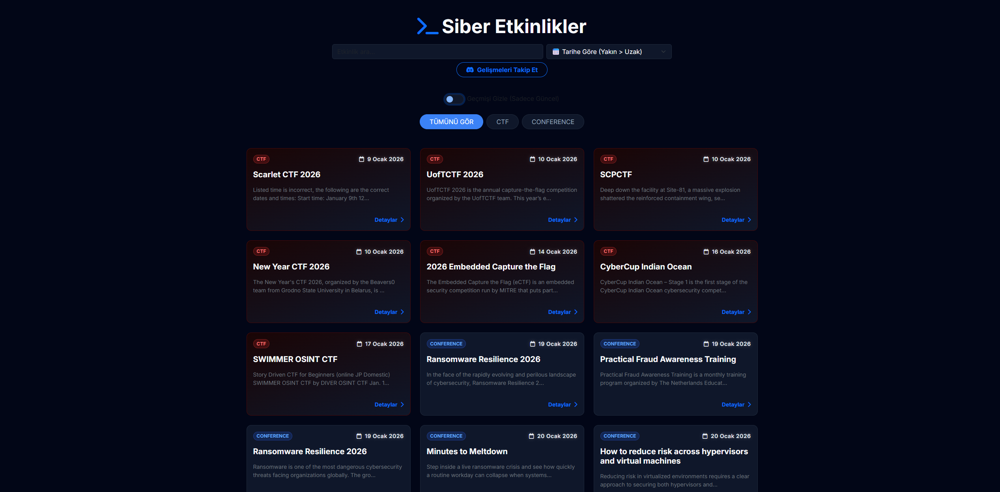
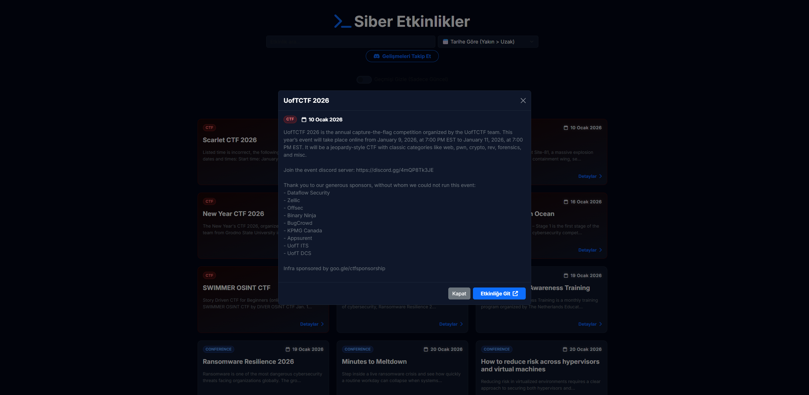

# 🛡️ Cyber Tracker - Siber Güvenlik Etkinlik Takipçisi

Cyber Tracker, dünya genelindeki **CTF (Capture The Flag)** yarışmalarını ve **Siber Güvenlik Konferanslarını** tek bir merkezden takip etmenizi sağlayan, Discord entegrasyonlu bir otomasyon aracıdır.

## 🌟 Özellikler

- **Otomatik Veri Toplama:** CTFTime API ve Infosec Conferences sitelerinden verileri anlık çeker.
- **Akıllı Filtreleme:** Etkinlikleri kategoriye (CTF, Konferans) veya isme göre filtreleyin.
- **Discord Entegrasyonu:** Yeni bir etkinlik eklendiğinde Discord kanalınıza otomatik bildirim gönderir.
- **Karanlık Mod Arayüzü:** Göz yormayan, hacker temalı modern arayüz.
- **Kişiselleştirilmiş Takip:** Kendi Webhook adresinizi ekleyerek bildirimlere abone olabilirsiniz.

## 📸 Ekran Görüntüleri

### 1. Ana Sayfa ve Etkinlik Kartları
Karanlık tema ile tasarlanmış, filtrelenebilir etkinlik listesi.

### 2. Etkinlik Detay Popup'ı
Etkinliğe tıklandığında açılan detay penceresi.

### 3. Discord Bildirimleri
Yeni etkinlik tespit edildiğinde gelen otomatik bildirim.

## 🛠️ Teknolojiler

- **Backend:** Node.js, Express.js
- **Frontend:** EJS, Bootstrap 5, Vanilla JS
- **Veri Toplama:** Axios, Cheerio (Web Scraping)
- **Veritabanı:** JSON Based (Flat File Database)
- **Entegrasyon:** Discord Webhooks

## 🚀 Kurulum ve Çalıştırma

Projeyi kendi bilgisayarınızda çalıştırmak için adımları izleyin.

### 1. Projeyi Klonlayın

    git clone https://github.com/RFKaya/ctf-conference-tracker
    cd cyber-tracker

### 2. Bağımlılıkları Yükleyin

    npm install

### 3. Uygulamayı Başlatın

    node client.js

Tarayıcınızda `http://localhost:3000` adresine gidin.

## ⚙️ Yapılandırma

### Webhook Ayarları
Proje varsayılan olarak `database/webhooks.json` dosyasındaki adreslere bildirim gönderir. Arayüz üzerindeki "Gelişmeleri Takip Et" butonu ile yeni webhook ekleyebilirsiniz.

### Veri Güncelleme Sıklığı
Varsayılan olarak sistem **30 dakikada bir** yeni etkinlik kontrolü yapar. Bunu `client.js` içerisindeki `CHECK_INTERVAL` değeri ile değiştirebilirsiniz.

## 📂 Dosya Yapısı

    /cyber-tracker
    ├── client.js              # Ana sunucu dosyası
    ├── services/              # Scraper ve Bildirim servisleri
    ├── views/                 # EJS Arayüz dosyaları
    ├── database/              # JSON veritabanı (Events & Webhooks)
    ├── public/                # Statik dosyalar (CSS, JS, Img)
    ├── specs/                 # API ve DB dökümanları
    └── docs/                  # Mimari ve kurulum rehberi

## 🤝 Katkıda Bulunma

1. Bu depoyu forklayın.
2. Yeni bir dal (branch) oluşturun (`git checkout -b yeni-ozellik`).
3. Değişikliklerinizi commit yapın (`git commit -m 'Yeni özellik eklendi'`).
4. Dalınızı pushlayın (`git push origin yeni-ozellik`).
5. Bir Pull Request oluşturun.

## 📝 Lisans

Bu proje MIT lisansı ile lisanslanmıştır.